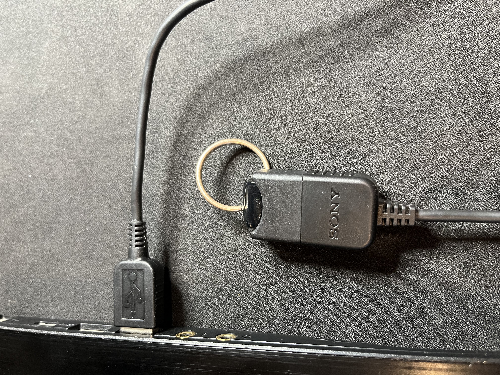
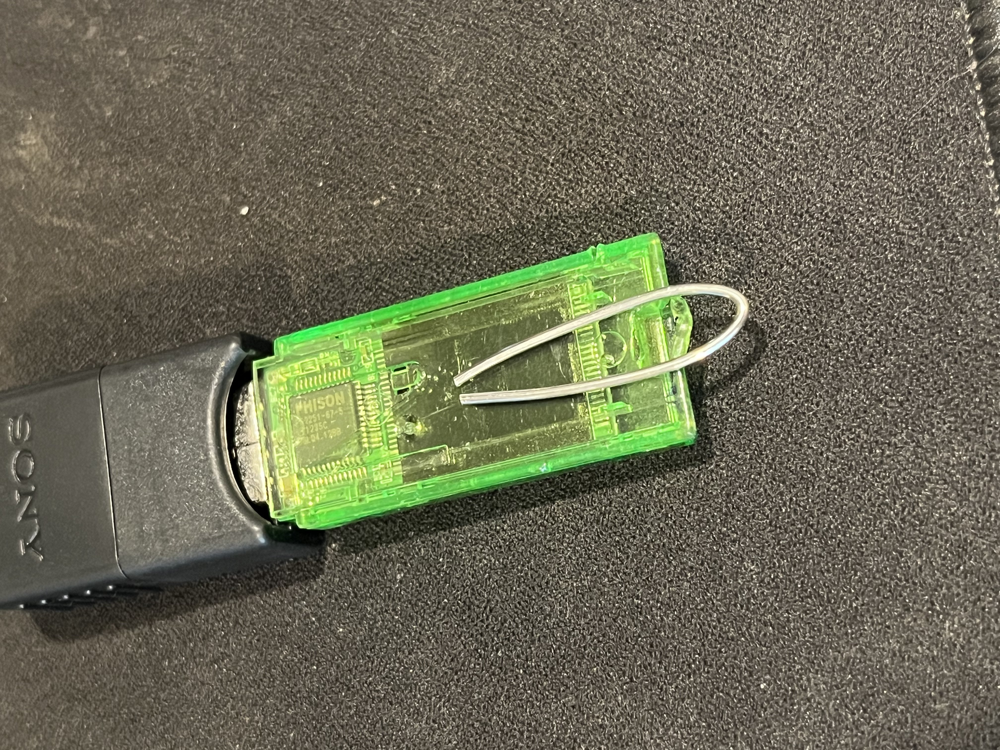
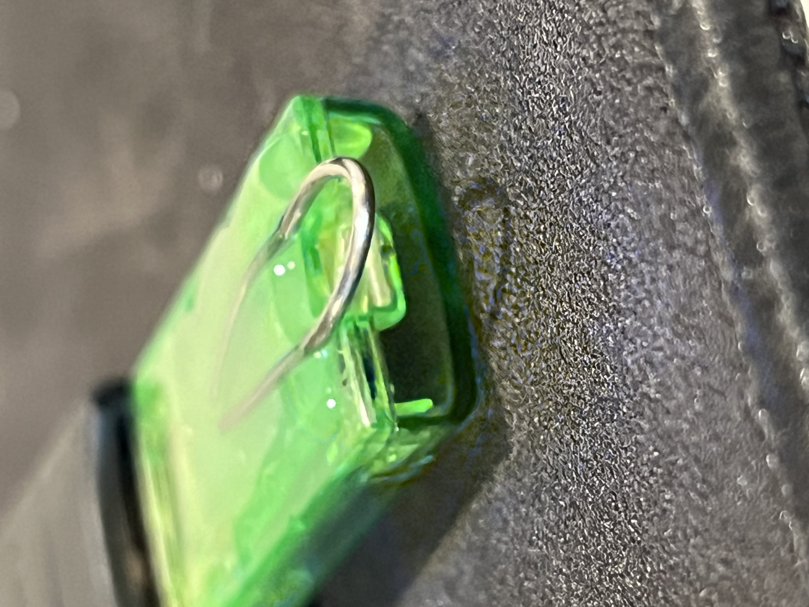
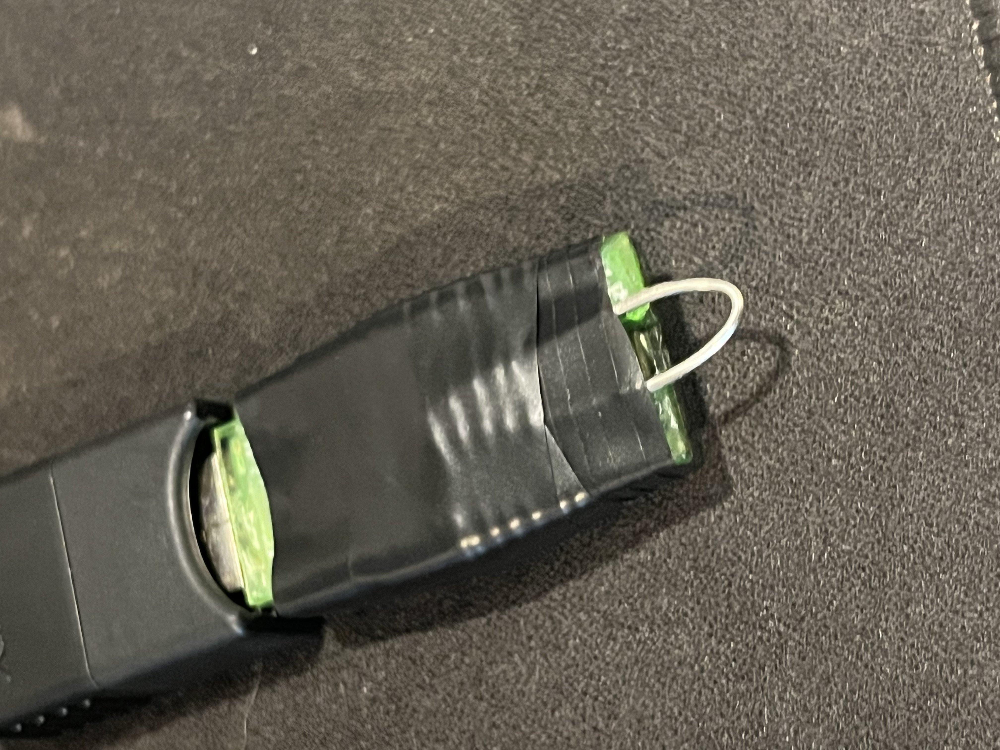
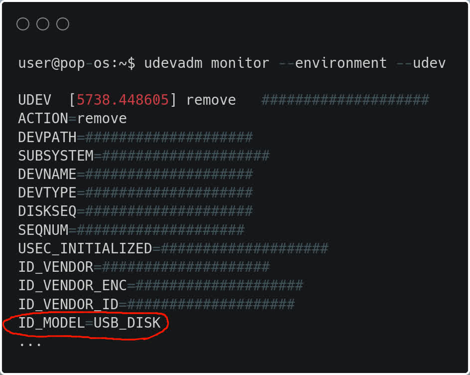

## Introduction

If you are reading this then chances are, you have encrypted your device's drive(s). If someone were to steal your device then they would be unable to access your data, but what if they stole it when you have already unencrypted the device? Chances are, you wont have enough time to hold down the power button and shut off your computer. This is where BusKill comes in

What exactly is Buskill? According to the official website ([Website](https://www.buskill.in) | [Archive](https://web.archive.org/web/20230609160530/https://www.buskill.in/)), Buskill is a "dead man switch triggered when a magnetic breakaway is tripped." When the USB device is disconnected, it triggers the computer to lock or shutdown. This allows us to protect our data's confidentiality and/or integrity from being compromised.

## Demo

### video permalink here

## DI-Why?

The concept of this "dead man switch" sounds great, but I did not want to order this hardware from another party (or order it at all) or have to manually arm/disarm the device every time. Fortunately, I found an article made by Michael Altfield ([Website](https://tech.michaelaltfield.net/2020/01/02/buskill-laptop-kill-cord-dead-man-switch/) | [Archive](https://web.archive.org/web/20230615230938/https://tech.michaelaltfield.net/2020/01/02/buskill-laptop-kill-cord-dead-man-switch/)), the founder of Buskill, that shows us how we can create our own Buskill device for cheap. Michael provides a lot of valuable information in this article, but I had to improvise.

The first main issue I encountered was a lack of availability for the mentioned magnetic breakaway USB adapters. The one showcased in the article was discontinued and I have had no luck finding any other USB Type A breakaway connectors except for one ([Website](https://www.distrelec.biz/en/adapter-magnetic-usb-plug-magnetic-usb-jack-rosenberger-mu1k101-s00z/p/30095359) | [Archive](https://web.archive.org/web/20230615231947/https://www.distrelec.biz/en/adapter-magnetic-usb-plug-magnetic-usb-jack-rosenberger-mu1k101-s00z/p/30095359)), but it was $36.58 + VAT for a relatively obscure product shipping from across the world.

Some might ask about USB-C instead as there is an abundance of USB-C magnetic breakaway cables/adapters online. Referencing a few Reddit posts/comments and some individual experiences ([Post](https://www.reddit.com/r/UsbCHardware/comments/motlhn/comment/gu6jtos/?utm_source=share&utm_medium=web3x&utm_name=web3xcss&utm_term=1&utm_content=share_button)), the current implementations of USB-C magnetic adapters "are not compliant with the USB specifications" and may damage devices. One user reported having their notebook "burned" following an accidental detach. The general concern is that your device may be damaged due to static electricity. I would assume that this is why the USB-A magnetic breakaway adapters were discontinued. I have since reached out to Griffin Technology asking if this is why, I will update this post when I receive a response. I am not one to blindly believe everything I read on the internet, but I am also not one to read the USB-C specifications as they are in excess of 300 pages and I have discovered a viable solution that doesn't rely on a magnetic connection.

## Do it

### Requirements/Materials

- Computer that supports udev rules (I am running a debian distribution)
- USB adapter/extension cord
- USB device (preferably with a hole for a keyring/string)
- Carabiner (or keyring/paracord)

### Hardware

First we will configure the Buskill cable itself. Take your carabiner (or keyring/paracord) and attach it to the USB device (which should have a hole). Plug your USB device into the adapter/extension cord. Ensure that the connection isn't too tight, preventing the device from coming out. Also make sure that the connection isn't too loose, where any slight movement would result in a disconnection. Connect the cable to your computer. I managed to find all of the parts I need just laying around in some storage bins, here is what it looks like:



### What shouldn't you do?

For anyone who is attempting this at home, I would advise that you find a strong, durable USB device that already has a hole for a carabiner/keyring. It is unlikely that a makeshift implementation will prove to be reliable; however, I still tried. I took a strong piece of wire that I found and bent it to serve as a keyhole. I place this wire on top of the flat side of a USB drive and super glued it, then I wrapped it with electrical tape. This was not the best of ideas, but I thought why not. I tested it with some weight and the wire slipped out at around 20lbs. I'm sure someone could achieve something greater on this front, but I am not that someone. Here are some images of the failed endeavor:

  

### Creating the script

Now that you have your DIY Buskill cable, it is time to create the script. The script we create is what will be executed when our USB device is disconnected. In this case, we will be creating a script that quickly shuts off the computer.

1.  Navigate to your home directory: `cd /home/user`
2.  Create a *sh* file: `touch buskill.sh`
3.  With your preferred text editor, open the *.sh* file you just created. `nano buskill.sh`
4.  In the *.sh* file, enter the following:

```
#!/bin/sh
shutdown -h now
```

5.  Save the script and quit the editor: `Ctrl + X, Yes, Return`

This *.sh* script will immediately shutdown the computer. You can replace line 2 and onwards with whatever you want to happen when the program is executed such as locking the screen, destroying the LUKS headers, or anything else you can think of. Make sure that you leave the shebang (line 1) in the script so that the correct interpreter is used.

### Finding the ID model

Before we configure our udev rule, we need to find out what the ID_MODEL of our USB device is.

1.  Insert the USB device that will be used with the Buskill cable, or the entire cable with the USB device attached.
2.  Open your terminal
3.  Execute the following command: `udevadm monitor --environment --udev`
4.  Remove your USB device/Buskill cable.
5.  Press `Ctrl + C` to stop monitoring.
6.  Scroll until you find the entry that matches your USB device and note down the ID_MODEL value.



### Configuring the udev rule

Now that we have our cable and our script set up, its time for the important part. We need to create and configure a udev rule that will execute our program upon the disconnection of our Buskill cable. Udev grants us the ability to dynamically manage device events. In our specific scenario, we will be creating a udev rule that executes the script we previously created when we disconnect our Buskill cable

1.  Open your terminal and navigate to the rules.d directory: `cd /etc/udev/rules.d`
2.  Create a *.rules* file: `touch 00-usb-ID_MODEL.rules` (replace ID\_MODEL) with the ID\_MODEL you noted previously.
3.  Open the file you just created with your preferred text editor: `sudo nano 00-usb-ID_MODEL.rules`
4.  Paste the following into the *.rules* file:

```
 ACTION=="remove", ENV{ID_MODEL}=="SanDisk_3.2Gen1", ENV{DISPLAY}=":0", RUN+="/bin/sh /home/USER/buskill.sh"
```

5.  Replace `SanDisk_3.2Gen1` with the ID_MODEL you noted previously.
6.  Replace any instance of `USER` with your user (so that it points to the script you created in your home directory).
7.  Save the file and quit the editor: `Ctrl + X, Yes, Return`

What exactly is all this? Well, lets break it down:

`ACTION=="remove"`

`ACTION` is a key (name) outlined by the udev man page. It matches the name of an event action. We have set this to `remove` because we want to run a script upon the removal/disconnection of the USB device. If you reference the image from above where we are obtaining the `ID_MODEL` of our device, you can also see the `ACTION` key and it's value.

`ENV{ID_MODEL}=="SanDisk_3.2Gen1"`

`ENV{key}` is a key that is used for matching against a device property value. There are multiple different device properties such as `ID_VENDOR`, `ID_VENDOR_ENC`, and others; however, we are only interested in the `ID_MODEL` key as it allows us to consistently identify the USB device associated with our Buskill cable. We are using the `==` operator to compare between the `ID_MODEL` of the USB device that prompted the `remove` action with our Buskill cable's `ID_MODEL`. In my case, the `ID_MODEL` is `SanDisk_3.2Gen1`. This allows us to specify what USB drive must be removed for our script to run. This way, we are still able to remove other USB devices without any interference. If you elect to remove this section, any USB device that is removed from your computer will cause the script to run.

`ENV{DISPLAY}=":0"`

Again, we are taking advantage of `ENV{key}`. In this instance, however, we are not doing any comparisons. This time, we are using the `=` operator in order to set the value of `DISPLAY` to `:0`. We are using this to instruct our program to run on the default host of our machine.

`RUN+="/bin/sh /home/msi/buskill.sh"`

This is where we specify what interpreter to use and what program will be executed. Similar to how we configured the *shebang* in our `buskill.sh` script, we will specify the rule to execute our program with the Sh interpreter by prepending the program's path with `/bin/sh`. We must ensure that we specify the absolute path for the script, as udev expects our program to reside in `/lib/udev` by default. In my case, the absolute path to the script is `/home/user/buskill.sh`.

## Conclusion

If everything has been properly configured, then your computer should quickly shutdown upon disconnection of the cable no matter the circumstances. In most circumstances, you would have the carabiner that is connected to you Buskill cable's USB device attached to your belt-loop or some other part that is connected to you. In the case that an adversary attempts to separate you from your computer, the USB device will be disconnected from the Buskill cable, forcing the computer to shut down. Huge thanks to Michael Altfield for creating Buskill, and still showing us how to do it for free. If you are looking to purchase a Buskill cable, visit: [https://www.buskill.in/store/](https://www.buskill.in/store/). If you are looking for the official Buskill app (open-source), vist: [https://github.com/BusKill/buskill-app](https://github.com/BusKill/buskill-app). This post serves as documentation for the errors I encountered when configuring my own Buskill cable and the solutions I found. If you encounter any issues, feel free to contact me: [addressaxiom@pm.me](mailto:addressaxiom@pm.me).