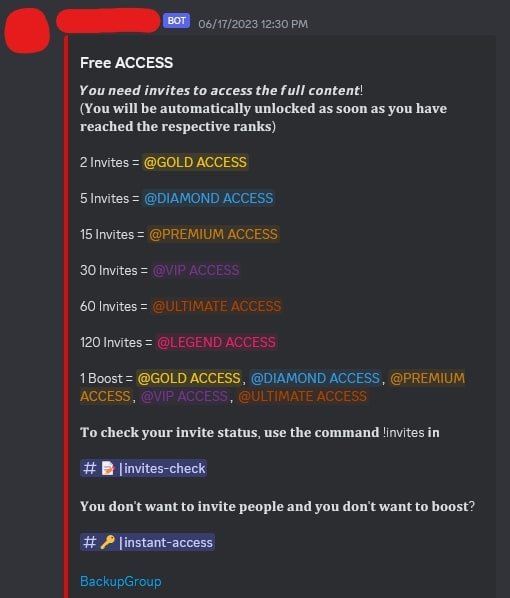
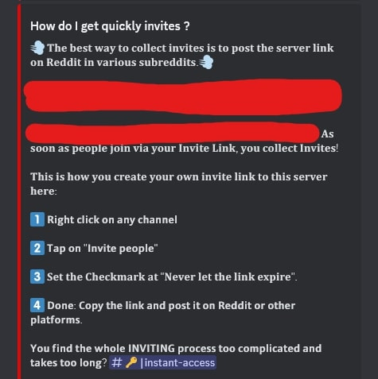
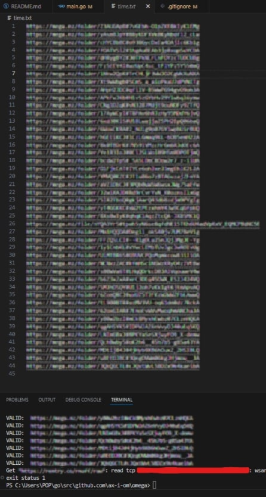
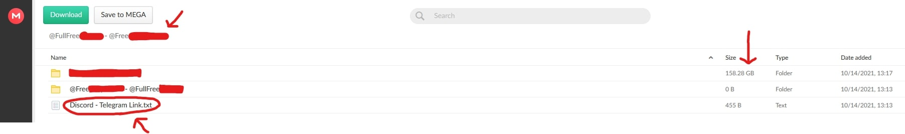
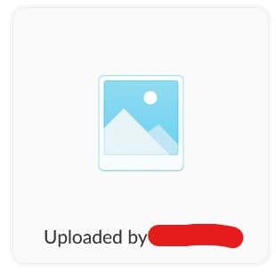
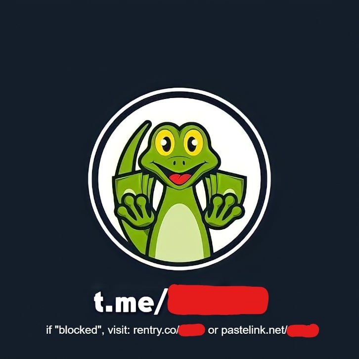
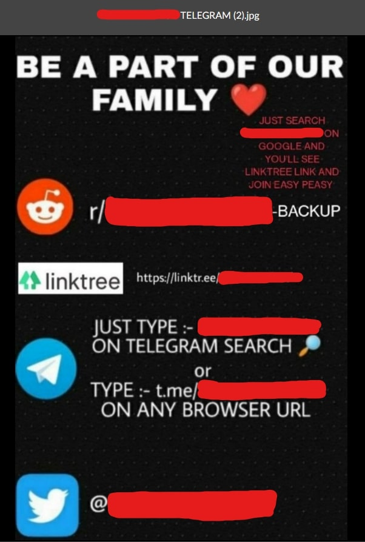
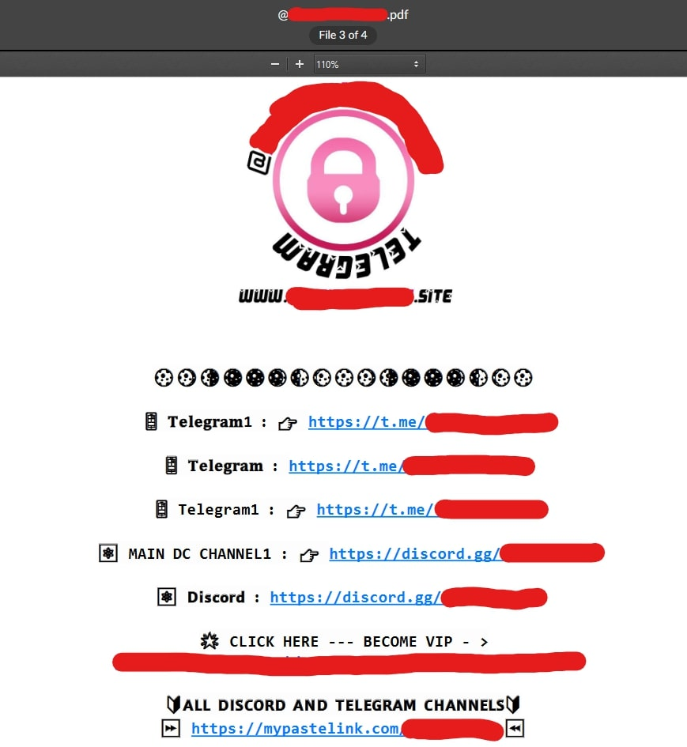
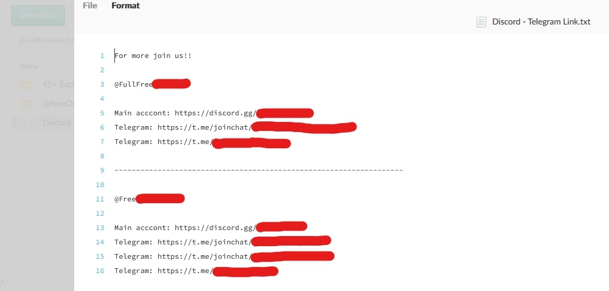

## Introduction

Recently, I found myself using a program I had previously created named [Netflip](https://github.com/ax-i-om/netflip) which allows me to "scrape paste sites for sensitive information." It works by essentially brute-forcing the random string of characters used to generate paste URLs (e.g. https\:\/\/rentry.co\/**ab12b**\/raw). The bolded area that says **ab12b** is what Netflip attempts to brute force, and is relatively easy considering the very short length of five characters. It allows you to filter the results via plain text and RegEx (Regular Expression) so that you don't have to manually filter out ridiculous amounts of useless information. 

This tool also includes a preview window that displays the contents of valid links within the interface, meaning you can get a glimpse of everything that is being scraped. During this process, I noticed some things that were occurring quite often. Many of these pastes included links to files/drives hosted by file sharing/file storage platforms such as Mega, Google Drive, Yandex Disk, and others. Of course, my curiosity led to me looking to see exactly what I had stumbled across. A lot of the links were no longer valid for whatever reason. The first valid link I found contained a text file, which held a Base64 encoded message. Decoding the message redirected me to another Mega link that, fortunately, was also valid. I was excited to follow this path and see what awaited at the end, but unfortunately, it was just a brush file. I continued my search and found more valid links that were not so boring. Inside these drives were heaps of stolen content of all different types. This was a crude violation of the Mega Terms of Service, Copyright, and Piracy Statutes. In some cases, the content being distributed was a direct violation of human rights.

## Monetization

In most cases, these groups that distribute the stolen content don't put a direct paywall in front of it. They use services like Linkvertise and other ad links that generate revenue from clicks and advertisements. They also increase their revenue by requiring their members to refer others before they can access anything. They may sometimes even form partnerships with other groups that redistribute stolen content. Below are images of messages inside of a discord group that distributes stolen content, where they require individuals to refer others to access specific content. They also provide instructions on how to easily refer others and even an extra section where you can pay if you don't feel like inviting people.





As aforementioned, they don't only require referrals or a single paywall. They also put everything behind ad links like Linkvertise, which requires individuals to complete certain tasks like reading sponsored articles, viewing advertisements, or downloading applications. Linkvertise grants earnings equal to around 9.35 USD per 1,000 clicks, or .00935 USD per click. One of these groups uses paste sites and chains Linkvertise links to increase earnings has a paste that serves as a sort of "featured index," where there are 22 content links. The first content link redirects to a Linkvertise page, and after completion, we see that 2,231 individuals have viewed the resulting page. That is 2,231 clicks. This paste redirects the user to one more Linkvertise page, which points to another paste. This second paste has 2,765 views. That is a total of 4,996 clicks or around 46.71 USD. The second listing on their list of 22 links collected a total of around 3,427 clicks or 32.04 USD. The third only used one instance of Linkvertise, collecting around 13.94 USD. The fourth earned around 20.93 USD. One link in the content list ended up broken, but the remaining 21 functioned properly.

The total revenue from the remaining 21 links was 720.87 USD, purely from Linkvertise. This also only came from their "featured" content, meaning there is much more that they are distributing via services like Telegram and Discord. That is an average of 34.33 USD for each folder/drive of (stolen) content. 

## Approach

I realized how much of an issue this is, but also how I can use this to my advantage. These links to Mega drives/files aren't naturally indexed by search engines, meaning that their discovery is essentially impossible unless someone directly shared this link with you or publicly uploaded it somewhere. This previously meant that there was no straightforward answer for discovering bad actors using Mega as a hub for the storage and distribution of stolen content. We also couldn't *guess* the Mega drive's ID and/or decryption key in an efficient manner, considering the combined length/complexity; however, now that individuals have started using paste sites as a medium for distribution, we don't have to. All we have to do is guess the five-character string that is used as the identifier for the paste, and we can guess these *really* fast. This also means that any content discovered through this process was meant to be shared, meaning we are not directly violating anyone's privacy.

After realizing this, I quickly got to work on developing a more refined solution, designed specifically to scrape and extract links to these file-sharing/storage drives. I salvaged and modified some code for generating a random string of characters using two arguments: the length of the string, and what characters to choose from. The paste site that Vigor currently scrapes from is Rentry.co, which uses a five-character long string consisting of lower case characters (a-z), upper case characters (A-Z), and numbers 0-9. We use this section of the code to brute force the Rentry.co paste identifier string until we get a hit. We differentiate between hits and misses by using the response's status code. If the status code is 200 (OK), then we have a hit. If it is anything else, then it is a miss and we continue. 

After we get a hit, the next step is to check whether or not the *raw* paste contains a Mega link. This can be achieved relatively easily by using RegEx. Here is the expression I created that can accurately identify any valid Mega file and/or folder. 

``` 
https://mega.nz/(folder|file)/([a-zA-Z0-9]{0,8})#([a-zA-Z0-9_-]{43}|[a-zA-Z0-9_-]{22})
```

This will NOT extract Mega links that do not include a decryption key in the URL. Mega links quickly differentiate between files and folders in the URL. Both files and folders have an ID of eight characters in length, consisting of lower case characters (a-z), upper case characters (A-Z), and the numbers 0-9. This is followed by a pound (#) symbol, which separates the ID from the decryption key. The decryption key can consist of lower case characters (a-z), upper case characters (A-Z), and the numbers 0-9; however, the decryption key also may include underscores ( _ ) and dashes/hyphens ( - ). Unlike the IDs, the decryption keys do differentiate in length based on whether or not it is a file or folder. Folders have a decryption key of 22 characters in length, whereas files have a decryption key of 43 characters in length. We will use the same expression to later extract any identified links from the paste.

Now that we have extracted our Mega link, we must check whether or not it is still online. There is not much use in scraping offline Mega links in our scenario. The Mega API (Application Programming Interface) makes this extremely easy.  Here is what the request URL looks like in Vigor: 

```
https://g.api.mega.co.nz/cs?id=5644474&n=ID
```

In this URL, we replace **ID** with the eight-character identifier in our extracted Mega link. This is quite easy to do using RegEx, thanks to the contextual characters present in the URL. Passing the identifier to this API will mainly return one of two values. If it returns a value of **-2**, then our Mega link is online. If it returns any other value (typically **-9**), then our Mega link is invalid. 

Now all that is left to do is to output the Mega link, where we both write it to the console and write it to a specified text file. 



The program is quick, but unfortunately, it is bottlenecked by rate limiting. I decided not to bypass this to avoid causing any heavy loads or interfering with operations in any manner but may implement proxy list support to Vigor in the future to circumvent this issue. Without bypassing the rate limits, I was able to scrape 350 online Mega links in around 30 minutes total.

Here is a link to the repository containing the program created and used in this article: [Vigor](https://github.com/ax-i-om/vigor)

## Results

Now I had to evaluate every one of these links which took around four hours total. The text file containing the links had each link separated by a new line. My method of annotation was to write a descriptive tag next to each link based on its contents. Here is a key to the annotations I used:

**INFRINGING** - identifies content that infringes copyright/piracy statutes whilst not being obscene (movies, tv shows, music, video games, etc...).

**OBSCENE** - identifies content that is infringing and obscene/indecent. 

**REASONABLE** - identifies content that is empty or requires further inspection beyond simply viewing the content metadata (downloading, streaming, previewing, etc...), but we can reasonably assume that the contents are infringing, obscene, or objectionable based on the remaining metadata (title, folder names, remaining marks, etc...).

**OBJECTIONABLE** - identifies content that falls under Mega's definition of objectionable material, and typically represents exploitative materials.

**OTHER/NONE** - identifies content that falls outside of the aforementioned categories, and according to inspection, isn't exploitative, obscene, or infringing in any manner.

Unfortunately, I was unable to mark any of the links as **OTHER/NONE**. Out of the 350 links, every single one of them was infringing or we could reasonably assume they were infringing.

Before continuing, here are some relevant clauses in the Mega Terms of Service under the ***"What you can't do"*** section that we will be referencing.
- 15.3 - infringe anyone else’s intellectual property (including but not limited to copyright) or other rights in any data;
- 15.7 - *use our service to:*
	- 15.7.1 - to store, use, download, upload, share, access, transmit, or otherwise make available, data in violation of any law in any country (including to breach copyright or other intellectual property rights held by us or anyone else);
	- 15.7.4 - to store, use, download, upload, share, access, transmit, or otherwise make available, unsuitable, offensive, obscene, or discriminatory information of any kind;

89.71% (314/350) of the folders/drives contained content that was infringing.
10.29% (36/350) of the folders/drives contained enough content/metadata which we could reasonably assume was infringing in some manner. These folders were typically empty, contained empty folders, or contained a zip file. 

There were many different methods I employed to evaluate the contents of the drives while avoiding exposure. The first and most obvious way was to look at the metadata of the drive and the folders/files that it contained. 



In the image above, we can see the title of the drive and the name of the 0B folder (censored). A quick search on the internet shows us that these groups do distribute stolen content, and use paste sites to distribute said content. We can also reference the size of the folder (we don't need to reasonably assume with this drive, but this is a good example nonetheless). Large files/folders typically indicate lots of photos and videos, as these files generally utilize more space than something like a configuration file. We can also reference the metadata of remaining files, which usually contain group information/markings. For example, a group that marks every single file with its name.



Groups who leave their logo:



Some groups leave images, .pdf files, and .txt files containing methods of contact.





Out of the 314 folders/drives that were guaranteed to contain infringing content, only 1.91% (6/314) of them were not obscene. This means their content consisted of media like movies, TV shows, video games, music, and other common forms of entertainment/media. 

94.9% (298/314) of them contained content that was obscene/indecent but doesn't necessarily fall under the definition of objectionable content. [Mega's definition of objectionable content](https://mega.io/takedown#Objectionable-material) is ***child exploitation material, violent extremism, bestiality, zoophilia, gore, malware, hacked/stolen data, passwords*** or ***other material as defined in [section 3 of the Films, Videos, and Publications Classification Act of 1993](https://www.legislation.govt.nz/act/public/1993/0094/latest/DLM313407.html) or other seriously harmful material***. Although these materials aren't necessarily objectionable according to the above definitions, they are still against all of the aforementioned Mega Terms of Service clauses (*15.3, 15.7.1, 15.7.4*). 3.18% (10/314) of the folders/drives contained materials that could be described as objectionable.

According to the [Objectionable material](https://mega.io/takedown#Objectionable-material) section in Mega's [Takedown guidance policy](https://mega.io/takedown), Mega "may take down or disable access to such material, close the user’s account and provide account details and other data to the appropriate authorities as it sees fit." Unfortunately, they make it explicitly clear that they are *not* obligated to do so. They also don't provide any simple methods of reporting said content like many other services do. Unfortunately, I am unable to report an extremely large majority of the content as it does not "infringe on the copyright of someone I am authorized to represent." Fortunately, Mega does offer an email address [abuse@mega.nz](mailto:abuse@mega.nz) for anyone to report any objectionable/abusive content, which I promptly used (August 7th, 2023) to report the 10 drives/files that contained content that could be described as objectionable. In less than 45 minutes, they responded. They were requesting more information regarding the provided drives/files, specifically what I consider a Terms of Service violation and a description of each link.  I described how each link falls under their definition of objectionable material, and what specifically defines it as objectionable. In less than 25 minutes, all of the drives/files were removed and the user's accounts were closed for "gross violation of MEGA's Terms of Service."  They have shown that given the proper information, they are diligent in removing objectionable/exploitative content. Considering the ease of this, I plan to properly annotate and submit the remaining 304 links that contain infringing content in an attempt to have them removed and the accounts of those responsible for distributing them, closed.

## Summary

Although a bit rough-edged, Vigor has shown that it is capable of efficiently extracting exploitative materials being distributed by using paste sites as a medium of discovery. This means that we can interfere with the distribution of said content more effectively. 

Of course, this is only the tip of the iceberg. There is a much deeper issue occurring below the surface; however, I plan to broaden Vigor's discovery capabilities to assist in this fight. Instead of only searching for valid Mega links, I will also implement searches for Gofile, Bunkr, Dood, Google Drive, Yandex Disk, Cyberdrop, and Sendvid links. Alongside searching for other file-sharing services, Vigor will also search through other paste services such as pasteall.org, paste.in, and paste.ee. Another interesting capability I plan to add is recursive discovery, meaning that if a paste contains another paste, ad-link, or shortened URL, Vigor will automatically search said links for files, drives, or other links. Of course, I will likely implement proxy list support to bypass any rate-limiting, as that appears to be the primary bottleneck.